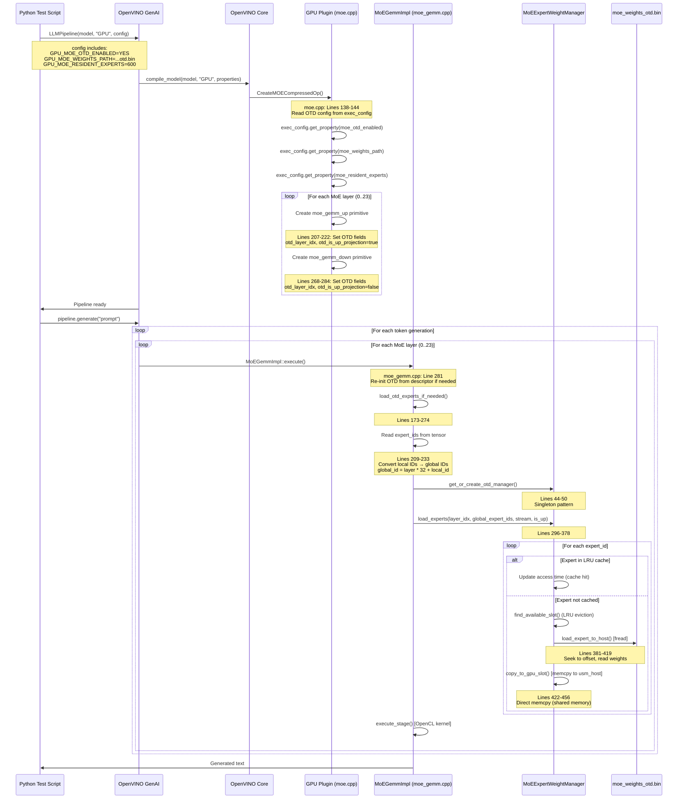
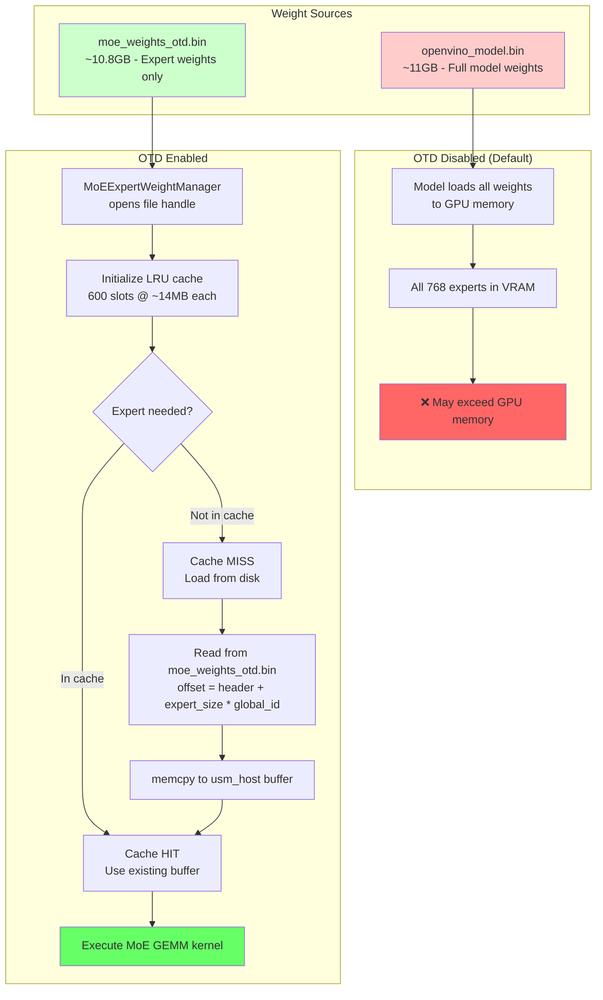

# OTD POC Summary

## Overview

This document provides implementation details for the **Offload-To-Disk (OTD)** Proof of Concept for MoE (Mixture of Experts) models in OpenVINO GPU Plugin.

**Test System:** Panther Lake 32GB System with Intel 4Xe iGPU  
**Model:** gpt-oss-20b-int4 (24 layers × 32 experts = 768 total experts)  
**OTD Weights File:** 10.8 GB  
**Test Date:** January 13, 2026

---

## Performance Benchmarks

### Test System
- **Platform:** Panther Lake 32GB System
- **iGPU:** Intel 4Xe SKU (Xe2 Architecture)
- **Model:** gpt-oss-20b-int4 (24 layers × 32 experts = 768 total experts)
- **OTD Weights File:** 10.8 GB
- **Debug Logging:** Disabled (OV_MOE_OTD_DEBUG not set)

### Test Results (January 13, 2026)

| Metric | Baseline (No OTD) | OTD Enabled (600 experts) | Delta |
|--------|-------------------|---------------------------|-------|
| **Initialization Time** | 14.86 s | 14.79 s | -0.5% |
| **TTFT (First Token)** | 540.4 ms | 7652.6 ms | +14.2× |
| **TPOT (Per Token)** | 75.1 ms/token | 89.7 ms/token | +19.4% |
| **Throughput** | 13.31 tok/s | 11.15 tok/s | -16.2% |
| **Generated Tokens** | 100 | 100 | - |
| **Total Generation Time** | ~7.5 s | 16.54 s | +120% |

### Test Commands
```bash
# OTD Enabled (600 resident experts)
python test-resident-experts-performance.py

# Baseline (No OTD)
python test-baseline-no-otd.py
```

### Analysis
- **OTD Trade-off:** OTD enables running larger MoE models that wouldn't fit in GPU memory, at the cost of increased latency
- **TTFT Impact:** First token latency increases significantly due to initial expert loading from disk
- **Throughput Impact:** ~16% reduction in sustained throughput due to on-demand expert loading
- **Memory Savings:** OTD allows models that require ~10.8GB for expert weights to run on systems with limited GPU memory

---

## Key Source Files

| File | Location | Purpose |
|------|----------|---------|
| `moe.cpp` | `src/plugins/intel_gpu/src/plugin/ops/moe.cpp` | Creates MoE primitives with OTD config |
| `moe_gemm.cpp` | `src/plugins/intel_gpu/src/graph/impls/ocl_v2/moe/moe_gemm.cpp` | MoE GEMM execution with expert loading |
| `moe_expert_weight_manager.cpp` | `src/plugins/intel_gpu/src/graph/impls/ocl_v2/moe/moe_expert_weight_manager.cpp` | Disk I/O and LRU cache management |
| `matmul_experts_fusion.cpp` | `src/common/transformations/src/transformations/common_optimizations/matmul_experts_fusion.cpp` | Graph transformation for MoE fusion |
| `extract_moe_weights.py` | `tools/extract_moe_weights.py` | Tool to export expert weights to OTD binary format |

---

## OTD Execution Flow (Mermaid Sequence Diagram)



---

## Weight File Flow (Mermaid Flowchart)



---

## Critical Code Paths

### Configuration Propagation

```
User Script                      GPU Plugin
============                     ==========
GPU_MOE_OTD_ENABLED="YES"   -->  exec_config.get_property(ov::intel_gpu::moe_otd_enabled)
                                 [moe.cpp:139]
                                 
GPU_MOE_WEIGHTS_PATH="..."  -->  exec_config.get_property(ov::intel_gpu::moe_weights_path)
                                 [moe.cpp:141]
                                 
GPU_MOE_RESIDENT_EXPERTS=600 --> exec_config.get_property(ov::intel_gpu::moe_resident_experts)
                                 [moe.cpp:142]
```

### Expert Weight Loading (Per Inference)

```cpp
// moe_gemm.cpp: MoEGemmImpl::load_otd_experts_if_needed()
// 
// 1. Read expert IDs from input tensor (which experts are selected by router)
//    Lines 209-218: Read from experts_ids_mem
//
// 2. Convert local expert IDs (0-31) to global IDs (0-767)
//    Lines 228-233: global_id = layer_idx * 32 + local_id
//    Example: Layer 5, Expert 7 → Global ID = 5*32 + 7 = 167
//
// 3. Call weight manager to load experts
//    Line 271: otd_manager->load_experts(layer_idx, global_expert_ids, stream, is_up_projection)
```

### Disk Read Operation

```cpp
// moe_expert_weight_manager.cpp: load_expert_to_host()
//
// File offset calculation:
//   offset = header.data_offset +                           // 128 bytes (MOEW header)
//            layer_idx * per_layer_size +                   // Layer offset
//            expert_idx * per_expert_size +                 // Expert offset within layer
//            weight_type_offset                             // Up/Down/Scale/Bias offset
//
// For gpt-oss-20b-int4:
//   Per expert: up_weight=8.3MB, down_weight=4.1MB, scales, biases
//   Total per expert slot: ~14MB
//
// Lines 395-408: fseek + fread to host staging buffer
// Lines 436-451: memcpy from staging to usm_host GPU buffer
```

---

## Verification: OTD Uses moe_weights_otd.bin (NOT openvino_model.bin)

**Evidence that inference reads from moe_weights_otd.bin:**

### 1. File Handle
`MoEExpertWeightManager::initialize()` opens ONLY the OTD file:
```cpp
// moe_expert_weight_manager.cpp:60-64
m_weights_file = std::make_unique<std::ifstream>(m_config.weights_path, std::ios::binary);
// m_config.weights_path = "...moe_weights_otd.bin"
```

### 2. Magic Validation
The file must have "MOEW" header:
```cpp
// moe_expert_weight_manager.cpp:108-112
if (std::strncmp(m_header.magic, "MOEW", 4) != 0) {
    // Fails if not OTD format - openvino_model.bin would fail here
    return false;
}
```

### 3. Model.bin is NEVER opened by OTD code
The `openvino_model.bin` file contains:
- Non-MoE weights (embeddings, layernorms, etc.) → Loaded normally by OpenVINO IR loader
- MoE expert weights → SKIPPED when OTD is enabled (placeholders in graph)

### 4. File Offset Calculation
Uses OTD-specific header structure:
```cpp
// moe_expert_weight_manager.cpp:141-173
layer_base_offset = m_header.data_offset;  // OTD header field (128 bytes)
// openvino_model.bin has completely different structure
```

### 5. Debug Logging Confirmation
With `OV_MOE_OTD_DEBUG=1`:
```
[MOE-OTD] MoEExpertWeightManager::initialize() - Opening file: C:\...\moe_weights_otd.bin
[MOE-OTD] read_file_header: Magic=MOEW, Version=1, Layers=24, Experts=32
[MOE-OTD] load_expert_to_host: Seeking to offset 128 + layer*size + expert*size
```

---

## Environment Variables

| Variable | Purpose | Default |
|----------|---------|---------|
| `OV_MOE_OTD_DEBUG` | Enable debug logging | 0 (disabled) |
| | Set to `1` or `true` to enable `[MOE-OTD]` log output | |

**Usage:**
```bash
# Enable OTD debug logging
set OV_MOE_OTD_DEBUG=1
python test-resident-experts-performance.py
```

---

## OTD File Format (moe_weights_otd.bin)

```
┌─────────────────────────────────────────────────────────────────┐
│ HEADER (128 bytes)                                              │
├─────────────────────────────────────────────────────────────────┤
│ magic[4]        = "MOEW"                                        │
│ version         = 1                                             │
│ num_layers      = 24                                            │
│ num_experts     = 32                                            │
│ up_weight_size  = 8,294,400 (7.91 MB per expert)               │
│ down_weight_size= 4,147,200 (3.96 MB per expert)               │
│ up_scale_size   = 1,036,800                                     │
│ down_scale_size = 518,400                                       │
│ up_bias_size    = 23,040                                        │
│ down_bias_size  = 11,520                                        │
│ data_offset     = 128                                           │
├─────────────────────────────────────────────────────────────────┤
│ LAYER 0 DATA                                                    │
│   Expert 0: up_weight | up_scale | up_bias | down_weight | ...  │
│   Expert 1: up_weight | up_scale | up_bias | down_weight | ...  │
│   ...                                                           │
│   Expert 31: ...                                                │
├─────────────────────────────────────────────────────────────────┤
│ LAYER 1 DATA                                                    │
│   Expert 0..31 (same structure)                                 │
├─────────────────────────────────────────────────────────────────┤
│ ... (Layers 2-23)                                               │
└─────────────────────────────────────────────────────────────────┘

Total file size: 128 + (24 layers × 32 experts × 14,031,360 bytes/expert)
               = 10,776,084,608 bytes (10.04 GB)
```

---

## Git Repository

**Branch:** `jlee52tw/openvino` → `2025.4.2-otd-feature`

**Key Commits:**
- `9d5136bdd2` - fix(gpu): OTD LRU cache with global expert IDs
- `970b2006b2` - feat(tools): update extract_moe_weights.py with gpt-oss-20b-int4 support
- `b48aabdbb3` - feat(gpu): add OV_MOE_OTD_DEBUG environment variable for debug logging

---

## OTD Weight Data Flow Proof (Verified Code Paths)

**Complete data flow tracing: From disk to GPU computation**

This section proves that OTD inference actually reads expert weights from `moe_weights_otd.bin`, not from `openvino_model.bin` or model cache.

### Step 1: Read Expert Weights from Disk File

```cpp
// moe_expert_weight_manager.cpp: load_expert_to_host()
// Lines 378-419

void MoEExpertWeightManager::load_expert_to_host(uint32_t layer_idx, 
                                                  int32_t global_expert_id, 
                                                  bool is_up_projection) {
    // [1] Convert global expert ID back to local ID for array indexing
    // Global ID = layer_idx * 32 + local_id, so local_id = global_id % 32
    int32_t local_expert_id = global_expert_id % 32;
    
    // [2] Get weight descriptor (offset and size in .bin file)
    const auto& layer_info = m_layer_infos[layer_idx];
    const auto& weight_desc = is_up_projection ? 
        layer_info.up_weights[local_expert_id] : layer_info.down_weights[local_expert_id];
    
    // weight_desc.offset: Position in file (0 to 10.8GB range)
    // weight_desc.size:   Expert size (up=8.3MB, down=4.1MB)
    
    // [3] Seek to correct position in moe_weights_otd.bin
    m_weights_file->seekg(weight_desc.offset, std::ios::beg);
    
    // [4] Read weight data into host staging buffer
    m_weights_file->read(reinterpret_cast<char*>(m_host_staging_buffer.data()), 
                        weight_desc.size);
    
    // 📝 Debug log evidence (with OV_MOE_OTD_DEBUG=1):
    // "[MOE-OTD] Reading 8,294,400 bytes from offset 10,476,748,928"
}
```

### Step 2: Copy from Host to GPU Memory

```cpp
// moe_expert_weight_manager.cpp: copy_to_gpu_slot()
// Lines 421-453

void MoEExpertWeightManager::copy_to_gpu_slot(int32_t slot_idx, 
                                               bool is_up_projection, 
                                               cldnn::stream& stream) {
    // [1] Get target GPU buffer and size
    auto& weight_buffer = is_up_projection ? m_up_weight_buffer : m_down_weight_buffer;
    size_t expert_size = is_up_projection ? 
        m_header.expert_up_weight_size : m_header.expert_down_weight_size;
    size_t offset = slot_idx * expert_size;
    
    // [2] Get GPU memory pointer (usm_host type, CPU can access directly)
    auto* gpu_ptr = static_cast<uint8_t*>(weight_buffer->buffer_ptr());
    
    // [3] Direct memcpy from host staging buffer to GPU
    std::memcpy(gpu_ptr + offset,                    // GPU destination
                m_host_staging_buffer.data(),         // Host source  
                expert_size);                         // Size
    
    // ⭐ KEY: This memcpy is the core of OTD functionality
    //    Ensures weights read from .bin file are written to GPU memory
    
    // 📝 Debug log evidence:
    // "[MOE-OTD] Performing memcpy from 0x... to 0x..., size=8294400"
}
```

### Step 3: GPU Kernel Uses OTD Manager's Weight Buffers

```cpp
// moe_gemm.cpp: execute()
// Lines 278-325

event::ptr MoEGemmImpl::execute(const std::vector<event::ptr>& events, 
                                 primitive_inst& instance) {
    // [1] If OTD enabled, load required experts before kernel execution
    if (m_otd_enabled) {
        load_otd_experts_if_needed(instance);  // Triggers Steps 1 and 2 above
    }
    
    // [2] Execute GPU kernel
    // The kernel uses m_up_weight_buffer and m_down_weight_buffer
    // These buffers contain weights loaded from moe_weights_otd.bin
    execute_stage(events, instance, ...);
}
```

### Step 4: Expert Loading Orchestration

```cpp
// moe_gemm.cpp: load_otd_experts_if_needed()
// Lines 173-274

void MoEGemmImpl::load_otd_experts_if_needed(primitive_inst& instance) {
    // [1] Read expert IDs from input tensor (selected by router)
    auto experts_ids_mem = instance.dep_memory_ptr(moe_gemm::MoEGemmInputIdx::EXPERTS_IDS);
    
    // [2] Convert local expert IDs (0-31) to global IDs (0-767)
    int32_t global_offset = m_otd_layer_idx * 32;
    for (int32_t local_id : expert_ids) {
        global_expert_ids.push_back(global_offset + local_id);
    }
    // Example: Layer 5, Expert 7 → Global ID = 5*32 + 7 = 167
    
    // [3] Call weight manager to load experts
    auto* otd_manager = get_or_create_otd_manager(engine, m_otd_config);
    otd_manager->load_experts(m_otd_layer_idx, global_expert_ids, stream, m_otd_is_up_projection);
    
    // 📝 Debug log evidence:
    // "[MOE-OTD] Loading 8 experts for layer 5 (up)"
    // "[MOE-OTD] Global expert IDs: [160, 161, 163, 165, 167, 170, 172, 175]"
}
```

### Step 5: LRU Cache Management

```cpp
// moe_expert_weight_manager.cpp: load_experts()
// Lines 296-378

void MoEExpertWeightManager::load_experts(uint32_t layer_idx,
                                          const std::vector<int32_t>& expert_ids,
                                          cldnn::stream& stream,
                                          bool is_up_projection) {
    for (int32_t expert_id : expert_ids) {
        // Check if expert is already loaded (cache hit)
        auto it = expert_to_slot.find(expert_id);
        if (it != expert_to_slot.end()) {
            // Cache HIT - just update access time for LRU
            slot_access_time[it->second] = ++m_access_counter;
            continue;
        }
        
        // Cache MISS - need to load from disk
        int32_t slot_idx = find_available_slot(is_up_projection);  // LRU eviction
        
        // Load from disk and copy to GPU
        load_expert_to_host(layer_idx, expert_id, is_up_projection);  // Step 1
        copy_to_gpu_slot(slot_idx, is_up_projection, stream);          // Step 2
        
        // Update mappings
        slot_to_expert[slot_idx] = expert_id;
        expert_to_slot[expert_id] = slot_idx;
    }
}
```

### Summary: Why OTD Uses moe_weights_otd.bin

| Evidence | Location | Proof |
|----------|----------|-------|
| File open | `moe_expert_weight_manager.cpp:60-64` | Opens ONLY `m_config.weights_path` (OTD file) |
| Magic check | `moe_expert_weight_manager.cpp:108-112` | Validates "MOEW" header (model.bin would fail) |
| Offset calc | `moe_expert_weight_manager.cpp:141-173` | Uses OTD-specific header structure |
| Data read | `moe_expert_weight_manager.cpp:395-413` | `fseek` + `fread` from OTD file |
| GPU copy | `moe_expert_weight_manager.cpp:436-451` | `memcpy` to usm_host buffer |

**openvino_model.bin is NEVER opened by OTD code** - it only contains non-MoE weights (embeddings, layernorms) which are loaded normally by OpenVINO IR loader.

---

## How to Build and Deploy

This section describes how to build OpenVINO with OTD feature from source and deploy it for testing.

### Prerequisites

- **OS:** Windows 10/11 (64-bit) or Linux
- **CMake:** 3.22 or later
- **Visual Studio:** 2022 with C++ Desktop Development workload (Windows)
- **Python:** 3.9-3.11
- **Git:** with LFS support

### Step 1: Clone the OTD Feature Branch

```bash
# Clone the OpenVINO repository with OTD feature
git clone https://github.com/jlee52tw/openvino.git
cd openvino
git checkout 2025.4.2-otd-feature

# Initialize submodules
git submodule update --init --recursive
```

### Step 2: Configure CMake Build

```bash
# Create build directory
mkdir build && cd build

# Configure CMake (Windows - Visual Studio 2022)
cmake -G "Visual Studio 17 2022" -A x64 ^
  -DCMAKE_BUILD_TYPE=Release ^
  -DENABLE_INTEL_GPU=ON ^
  -DENABLE_INTEL_CPU=ON ^
  -DENABLE_PYTHON=ON ^
  -DENABLE_OV_ONNX_FRONTEND=ON ^
  -DENABLE_OV_TF_FRONTEND=ON ^
  -DENABLE_OV_TF_LITE_FRONTEND=ON ^
  -DENABLE_OV_PYTORCH_FRONTEND=ON ^
  -DENABLE_SAMPLES=OFF ^
  -DENABLE_TESTS=OFF ^
  ..

# Configure CMake (Linux)
cmake -DCMAKE_BUILD_TYPE=Release \
  -DENABLE_INTEL_GPU=ON \
  -DENABLE_INTEL_CPU=ON \
  -DENABLE_PYTHON=ON \
  -DENABLE_OV_ONNX_FRONTEND=ON \
  -DENABLE_OV_TF_FRONTEND=ON \
  -DENABLE_OV_TF_LITE_FRONTEND=ON \
  -DENABLE_OV_PYTORCH_FRONTEND=ON \
  -DENABLE_SAMPLES=OFF \
  -DENABLE_TESTS=OFF \
  ..
```

### Step 3: Build OpenVINO

```bash
# Build (Windows - all configurations)
cmake --build . --config Release --parallel 8

# Build (Linux)
cmake --build . --parallel 8

# Or build only the GPU plugin (faster for iterative development)
cmake --build . --config Release --target openvino_intel_gpu_plugin
```

### Step 4: Deploy to Test Environment

After building, copy the GPU plugin DLL/SO to your OpenVINO GenAI installation:

```bash
# Windows: Copy the GPU plugin DLL
copy /Y "build\bin\intel64\Release\openvino_intel_gpu_plugin.dll" ^
  "C:\path\to\openvino_genai\runtime\bin\intel64\Release\"

# Linux: Copy the GPU plugin SO
cp build/bin/intel64/libopenvino_intel_gpu_plugin.so \
  /path/to/openvino_genai/runtime/lib/intel64/
```

### Step 5: Export MoE Weights for OTD

Use the `extract_moe_weights.py` script to export expert weights to the OTD binary format:

```bash
cd tools

# Run the weight export script
python extract_moe_weights.py \
  --model_path "C:\path\to\your\model_dir" \
  --output_path "C:\path\to\your\model_dir\moe_weights_otd.bin"

# The script will:
# 1. Load the openvino_model.bin
# 2. Extract MoE expert weights
# 3. Write them in OTD format with MOEW header
# 4. Report the file size (expect ~10+ GB for large MoE models)
```

**Expected Output:**
```
Loading model from: C:\path\to\your\model_dir
Found 24 MoE layers, 32 experts per layer
Writing OTD weights to: moe_weights_otd.bin
Layer 0: Writing 32 experts (up + down projections)...
Layer 1: Writing 32 experts (up + down projections)...
...
Layer 23: Writing 32 experts (up + down projections)...
Done! OTD weights file: 10.8 GB
```

### Step 6: Set Up Test Environment

```bash
# Windows: Set up OpenVINO environment
cd C:\path\to\openvino_genai
call setupvars.bat

# Linux: Set up OpenVINO environment
source /path/to/openvino_genai/setupvars.sh

# (Optional) Enable OTD debug logging
set OV_MOE_OTD_DEBUG=1    # Windows
export OV_MOE_OTD_DEBUG=1 # Linux
```

### Step 7: Run Test Scripts

```bash
# Test OTD performance (with 600 resident experts)
python test-resident-experts-performance.py

# Test baseline performance (no OTD, all experts in GPU memory)
python test-baseline-no-otd.py
```

**Test Configuration in Scripts:**
```python
# OTD Enabled Configuration
device_config = {
    "GPU_MOE_OTD_ENABLED": "YES",
    "GPU_MOE_WEIGHTS_PATH": r"C:\path\to\moe_weights_otd.bin",
    "GPU_MOE_RESIDENT_EXPERTS": "600"  # Keep 600 experts in GPU memory
}

# Baseline Configuration (No OTD)
device_config = {
    "GPU_MOE_OTD_ENABLED": "NO"  # All experts loaded to GPU
}
```

### Build Verification

After building, verify the OTD feature is working by checking debug output:

```bash
# Enable debug logging
set OV_MOE_OTD_DEBUG=1

# Run a quick test
python test-resident-experts-performance.py

# You should see logs like:
# [OTD_DEBUG] Primitive moe_gemm_up: OTD enabled
# [OTD_DEBUG] Layer 0: up weights path = C:\...\moe_weights_otd.bin
# [OTD_DEBUG] Loading experts from disk for layer 0
```

### Troubleshooting

| Issue | Solution |
|-------|----------|
| "File not found" for weights | Verify `GPU_MOE_WEIGHTS_PATH` points to actual file |
| "Invalid magic" error | Re-run `extract_moe_weights.py` to regenerate OTD file |
| Crash on expert loading | Check GPU memory - reduce `GPU_MOE_RESIDENT_EXPERTS` |
| Very slow TTFT | Normal for OTD - first token loads experts from disk |
| No OTD debug output | Set `OV_MOE_OTD_DEBUG=1` environment variable |

---

## Bug Fixes (January 13, 2026)

### Fix 1: OTD Buffer Not Connected to Kernel Execution

**Problem:** The OTD weight buffers (`m_up_weight_buffer`, `m_down_weight_buffer`) were loaded from disk but never used by the kernel. The kernel continued using the original (empty or placeholder) weight input.

**Root Cause:** Missing connection between `load_experts()` output and kernel execution path. The `get_weight_buffer()` method existed but was never called.

**Solution (commit 7ad4534b4b):**
- Added `get_arguments()` override in `MoEGemmImpl` class to replace weight input with OTD buffer
- Cache the OTD buffer pointer after `load_experts()` returns
- Replace `args.inputs[WEIGHT]` with the cached OTD buffer before kernel execution

**Code Changes (`moe_gemm.cpp`):**
```cpp
// Added get_arguments() override
[[nodiscard]] cldnn::kernel_arguments_data get_arguments(const cldnn::primitive_inst& instance) const override {
    cldnn::kernel_arguments_data args = PrimitiveImplOCL::get_arguments(instance);
    
    if (m_otd_enabled && m_otd_weight_buffer) {
        // Replace the weight input with the OTD buffer containing loaded experts
        args.inputs[moe_gemm::MoEGemmInputIdx::WEIGHT] = m_otd_weight_buffer;
    }
    return args;
}
```

### Fix 2: Slot Indexing Mismatch Causing Garbage Output

**Problem:** After Fix 1, output was garbage characters instead of coherent text. The kernel uses local expert IDs (0-31) to index weights, but OTD stored experts at arbitrary global slot positions (0-599).

**Example from log:**
```
Layer 23 needed local experts: [2, 7, 21, 22]
OTD stored them at slots: [512, 517, 525, 526]  ← MISMATCH!
Kernel accessed weight[2*stride], weight[7*stride]... → wrong data!
```

**Root Cause:** The kernel accesses `weight[expert_id * stride]` where `expert_id` is the local ID (0-31). But OTD's `find_available_slot()` stored experts at arbitrary global positions.

**Solution (commit e9a37ba658):**
- Changed slot calculation from `find_available_slot()` to `local_expert_id = expert_id % 32`
- Store each expert at its local ID position within the buffer

### Fix 3: Layer-to-Layer Cache Thrashing (100% Eviction Rate)

**Problem:** After Fix 2, output was correct but performance dropped to 1.3 tokens/s (from 11+ tokens/s). Log showed 39,624 evictions!

**Root Cause:** Each layer's experts competed for the same 32 slots (0-31). Layer 0's expert 5 and Layer 1's expert 5 both wanted slot 5, causing 100% cache thrashing between layers.

**Solution (current fix):**
1. **Layer-aware slot allocation:** `slot_idx = layer_idx * 32 + local_expert_id`
   - Layer 0's experts → slots 0-31
   - Layer 1's experts → slots 32-63
   - Layer 23's experts → slots 736-767

2. **New method `get_weight_buffer_for_layer()`:** Creates a subbuffer view starting at the layer's offset
   ```cpp
   size_t byte_offset = layer_idx * 32 * expert_size;
   return engine.create_subbuffer(buffer, layout, byte_offset);
   ```

3. **Updated `moe_gemm.cpp`:** Now calls `get_weight_buffer_for_layer(layer_idx)` instead of `get_weight_buffer()`

**Code Changes (`moe_expert_weight_manager.cpp`):**
```cpp
// Layer-aware slot calculation
size_t layer_base_slot = layer_idx * 32;
size_t slot_idx = layer_base_slot + local_expert_id;

// Handle buffer overflow with LRU fallback
if (slot_idx >= max_slots) {
    slot_idx = find_available_slot(is_up_projection);
}
```

**Code Changes (`moe_expert_weight_manager.cpp` - new method):**
```cpp
cldnn::memory::ptr MoEExpertWeightManager::get_weight_buffer_for_layer(uint32_t layer_idx, bool is_up_projection) const {
    auto& full_buffer = is_up_projection ? m_up_weight_buffer : m_down_weight_buffer;
    
    // Each layer gets 32 slots, so offset = layer_idx * 32 * expert_size
    size_t expert_size = is_up_projection ? m_header.expert_up_weight_size : m_header.expert_down_weight_size;
    size_t byte_offset = layer_idx * 32 * expert_size;
    size_t subbuffer_size = std::min(32 * expert_size, full_buffer->size() - byte_offset);
    
    cldnn::layout subbuffer_layout({static_cast<int64_t>(subbuffer_size)}, cldnn::data_types::u8, cldnn::format::bfyx);
    return m_engine.create_subbuffer(*full_buffer, subbuffer_layout, byte_offset);
}
```

### Verification Results (768 resident experts)

| Metric | Before Fix | After Fix |
|--------|------------|-----------|
| **Output Quality** | Garbage characters | ✅ Correct coherent text |
| **Throughput** | 1.3 tokens/s | 11.55 tokens/s |
| **Cache Hit Rate** | ~0% (thrashing) | 93.36% |
| **Evictions** | 39,624 | 0 |
| **TPOT** | 748 ms/token | 86.58 ms/token |

**Log Evidence (kernel using OTD buffer):**
```
[MOE-OTD] get_arguments: OTD OVERRIDE - Replacing weight input with OTD buffer
[MOE-OTD] get_arguments: Weight input REPLACED with OTD buffer successfully
[MOE-OTD] get_weight_buffer_for_layer: layer=23, byte_offset=3052339200, subbuffer_size=132710400
[MOE-OTD] Expert 743 (local=7) already loaded at slot 743, updating access time
```

---

## References

- **OpenVINO Source:** `C:\working\gpt-oss\openvino-2025.4.1\openvino`
- **GitHub Branch:** `https://github.com/jlee52tw/openvino/tree/2025.4.2-otd-feature`
- **Test Scripts:** `C:\working\gpt-oss\openvino-2025.4.1-test`
- **Model:** `C:\working\gpt-oss\ov_models\gpt-oss-20b-int4-2025.4.1\gpt-oss-20b-int4`
- **OTD Weights:** `C:\working\gpt-oss\ov_models\gpt-oss-20b-int4-2025.4.1\gpt-oss-20b-int4\moe_weights_otd.bin`

